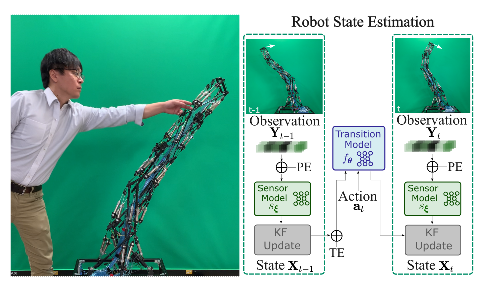

# softrobot_torch_filter
This paper introduces a novel approach for modeling the dynamics of soft robots, utilizing a differentiable filter architecture. The proposed approach enables end-to-end training to learn system dynamics, noise characteristics, and temporal behavior of the robot. A novel spatio-temporal embedding process is discussed to handle observations with varying sensor placements and sampling frequencies. The efficacy of this approach is demonstrated on a tensegrity robot arm by learning end-effector dynamics from demonstrations with complex bending motions. The model is proven to be robust against missing modalities, diverse sensor placement, and varying sampling rates. Additionally, the proposed framework is shown to identify physical interactions with humans during motion. The utilization of a differentiable filter presents a novel solution to the difficulties of modeling soft robot dynamics. Our approach shows substantial improvement in accuracy compared to state-of-the-art filtering methods, with at least a 24% reduction in mean absolute error (MAE) observed. Furthermore, the predicted end-effector positions show an average MAE of 25.77mm from the ground truth, highlighting the advantage of our approach. 

<p align="center">

</p>

## Getting Started
#### docker workflow

Clone the repo `git clone https://github.com/liuxiao1468/torch_filter.git`

#### Set the environment variables
Edit the `conf.sh` file to set the environment variables used to start the docker 
containers. 

```
IMAGE_TAG=  # unique tag to be used for the docker image.
CONTAINER_NAME=soft_robot  # name of the docker container.
DATASET_PATH=/home/xiao/datasets/  # Dataset path on the host machine.
CUDA_VISIBLE_DEVICES=0  # comma-separated list of GPU's to set visible.
```

#### Build the docker image
Run `./build.sh`

## Project Structure

#### Training or testing
Create or a modify a yaml file found in `./soft_robot` 
with the appropriate parameters. Set the mode parameter to perform the 
training or testing routine. 

```
mode:
    mode: 'train'  # 'train' | 'test'
```

Run the training and test script using the bash file `./run_filter.sh $CONFIG_FILE` 
where `$CONFIG_FILE` is the path to the config file. e.g. 
`./run_filter.sh ./config/tensegrity_xx.yaml`

View the logs with `docker logs -f $CONTAINER_NAME`

#### Tensorboard

Use the docker logs to copy the tensorboard link to a browser

```docker logs -f $CONTAINER_NAME-tensorboard```
 
#### Without Docker

If you don't want to use the docker container for training, you may directly use the
`train.py` script and pass in the config file. Make sure to have corresponding libraries and
dependencies installed on your local machine. Plase refer to `requirement.txt` and `Dockerfile` 
for those required packages.

Go to `./soft_robot` and then

Run `python train.py --config ./config/tensegrity_xx.yaml`


## Models
### DEnKF
Differentiable Ensemble Kalman Filter


## Datasets
#### Tensegrity_dataset
Ask IKemoto-san for the dataset of the soft robot (ikemoto@brain.kyutech.ac.jp)


## Results
<p align="center">

</p>
The real-time estimation of the state on the tensegrity robot arm is demonstrated in this study. Specifically, the `top` figure presents a motion sequence of the robot without applying external forces, while the `bottom` figure showcases the real-time tracking outcomes (along with the corresponding uncertainty) of the positions of the hand tip.

## Model Zoo
TBD

